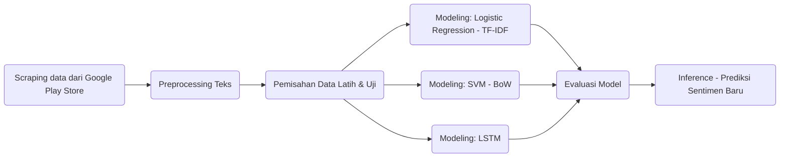

# Analisis Sentimen Ulasan Permainan Block Blast! pada Google Play Store


Foto oleh Mika Baumeister di [Unsplash](https://unsplash.com/id/foto/smartphone-samsung-galaxy-putih-menampilkan-ikon-QIpLrHJiv2o?utm_content=creditCopyText&utm_medium=referral&utm_source=unsplash)
      
## Overview
Proyek ini membangun analisis sentimen ulasan pengguna game Block Blast! di Google Playstore. Game ini booming di awal tahun 2025 dan sudah diunduh sebanyak 500 jt+ kali. Tujuan dilakukan analisis ini untuk mengetahui tanggapan pengguna aplikasi sehingga dapat menjadi masukan dan saran untuk pengembangan aplikasi selanjutnya. Analisis sentimen ini dilakukan dengan 3 skema:
1. Skema 1
Pelatihan: Logistic Regression
Ekstraksi Fitur: TF-IDF
Pembagian Data: 80/20

2. Skema 2
Pelatihan: Support Vector Machine (SVM)
Ekstraksi Fitur: Bag of Words (BoW)
Pembagian Data: 80/20

3. Skema 3
Pelatihan: Long-Short Term Memory (LSTM)
Ekstraksi Fitur: -
Pembagian Data: 70/30

## Tujuan Proyek
1. Mengembangkan sistem analisis sentimen
2. Mengetahui ulasan pengguna Block Blast!

## Pipeline



Penjelasan:
- **Scraping**: Mengambil ulasan Block Blast! dari Play Store.
- **Preprocessing**: Tokenisasi, stopwords removal, stemming (Sastrawi), dsb.
- **Modeling**: Tiga skema: Logistic Regression, SVM, LSTM.
- **Inference**: Prediksi sentimen baru berbasis model terlatih.

## Metodologi
- Dataset: 20000 rating dan review pengguna Block Blast! berbahasa Indonesia dari negara Indonesia dengan MOST_RELEVANT di Google PlayStore (sumber: Scraping dari [Google PlayStore](https://play.google.com/store/apps/details?id=com.block.juggle))

- Skema pelatihan:

1. Skema 1

Pelatihan: Logistic Regression

Ekstraksi Fitur: TF-IDF

Pembagian Data: 80/20

2. Skema 2

Pelatihan: Support Vector Machine (SVM)

Ekstraksi Fitur: Bag of Words (BoW)

Pembagian Data: 80/20

3. Skema 3

Pelatihan: Long-Short Term Memory (LSTM)

Ekstraksi Fitur: -

Pembagian Data: 70/30

## Evaluasi Model

**1. Skema 1**
- Logistic Regression - accuracy_train: 0.9143223369088579
- Logistic Regression - accuracy_test: 0.8950350782514841

**2. Skema 2**
- Support Vector Machine (SVM) - Accuracy (Train): 0.9330769749713284
- Support Vector Machine (SVM) - Accuracy (Test): 0.8963842417701026

**3. Skema 3**
- LSTM - Accuracy (Train): 0.8558995686999384
- LSTM - Accuracy (Test): 0.855884995507637

## Insight Utama
- Model berhasil memahami ulasan pengguna dan mengklasifikasikannya ke ulasan {0: 'Negatif', 1: 'Netral', 2: 'Positif'}
- Dibuat inference sederhana dengan python

## Tools & Teknologi
- Python, Google Colab (Bahasa & Utilitas)
- Pandas, NumPy (Data Processing)
- Scikit-Learn (Preprocessing & Modeling)
- NLTK, Sastrawi (NLP & Text Processing untuk Bahasa Indonesia)
- TensorFlow, Keras (Deep Learning Modeling)
- Google Play Scraper (Pengambilan data review)
- Joblib, TQDM (Utility)

## Cara Menjalankan
Clone repo:
```
git clone https://github.com/nafakhairunnisa/sentiment-analysis-blockblast-reviews.git
```
Install requirements:
```
pip install -r requirements.txt
```
Jalankan notebook:
```
jupyter notebook Scraping_Reviews_of_BlockBlast_on_Google_Play_Store.ipynb
jupyter notebook Analisis_Sentimen_pada_Ulasan_Pengguna_Block_Blast!_di_Google_Play_Store.ipynb
```
Jalankan inference_svm.ipynb:
```
jupyter notebook inference_svm.ipynb
```

## Future Work
- Deployment sebagai web service
- Menggunakan model lain seperti BERT, dll
